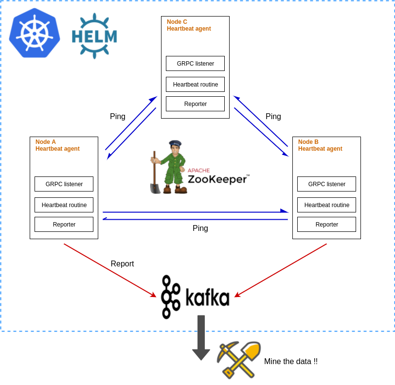
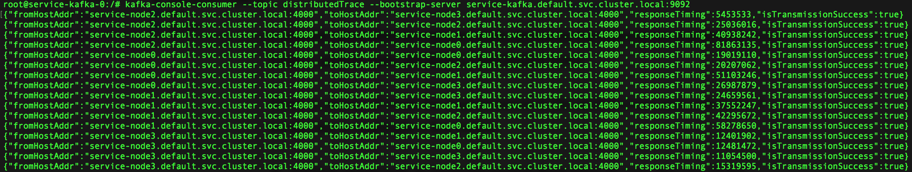

## Distributed trace


Distributed trace aims to track inter-node network performance across a cluster of machines.

This is motivated mostly by the nature of distributed workload across a cluster of machines.
A cluster compromises of different worker nodes with a single master node.
Each worker node can be located under different locality zones or have individual network policies enforced around it.
Moreover, each node can have different instance group with different amount of bandwidth.

The implementation of distributed trace closely follows a work done by [Microsoft](https://conferences.sigcomm.org/sigcomm/2015/pdf/papers/p139.pdf).

At present, we deploy a heartbeat agent to each node in the cluster. The agent is responsible for discovering all nodes within the cluster and reporting the time taken to issue pings to all other nodes within the cluster.

## Installation & deployment
#### Ensure that all dependencies are installed 
Install [go Kafka-client](https://github.com/confluentinc/confluent-kafka-go) from Confluent 
- Follow instructions listed in the link

Install [go Zookeeper](https://godoc.org/github.com/samuel/go-zookeeper/zk)
- ```go get github.com/samuel/go-zookeeper/zk```

Install google protobuf for go and OS
- protobuf [go client package](https://github.com/golang/protobuf)
- protobuf for Mac OS (google this :/)

Compile protobuf schema via: 
```go
protoc -I api/proto/v1/ --go_out=plugins=grpc:pkg/api/proto/ api/proto/v1/messages.proto
```

### Deploying locally via docker compose
To start the execution, run 
```shell script
docker-compose -f docker-compose.yml up
```

Docker compose will spin up 2 heart beat nodes, 1 Zookeeper node and 1 Kafka standalone node containing 1 broker.

To mine the pinged data, we can spawn a consumer that listens to the Kafka container under the topic `distributedTrace`

### Deploying on to Kubernetes
Alternatively, we can deploy the application onto a Kubernetes cluster via Helm charts.
There are 2 helm charts that need to be deployed.

#### Chart 1: Confluent Kafka Helm chart
Start by deploying Kafka brokers
```shell script
helm install --name service-kafka helm-charts/kafka
```

If your `--name` flag is set to another value, ensure that you update the value of KAFKA_BOOTSTRAP_SERVERS in heartbeat chart deployment
```shell script
# Modify the value for KAFKA_BOOTSTRAP_SERVERS in heartbeat chart deployment
value:  "<name>.{{ $.Release.Namespace }}.svc.cluster.local:9092"
```

#### Chart 2: Heartbeat agents & Zookeeper
We have to define the number of nodes that is present in our Kubernetes cluster (excluding master).

```yaml
# Modify nodes parameter in helm-charts/dt-charts/heartbeat/values.yaml 
# For a 4 node cluster, set
nodes: 4
```

There after, deploy the heartbeat agents and Zookeeper cluster
``` shell script
helm install --name distributed-trace helm-charts/dt-chart
```

In deployments to Minikube, you will encounter an issue where the pod is unable to ping its own service. 
This is an existing bug in minikube as of version 1.3.1.

Reference can be found [here](https://github.com/kubernetes/minikube/issues/1568) 

The work around is to do this:
```shell script
minikube ssh
sudo ip link set docker0 promisc on
```

### Mining the data
The present implementation exposes all Kafka brokers as **ClusterIp**. In order to obtain the data in Kafka, we would have to exec into the pod to view it.

```shell script
kubectl get pods 
kubectl exec -it <kafka-pod-name> -- /bin/bash
```

We can then poll a topic using
```shell script
kafka-console-consumer --topic distributedTrace --bootstrap-server {{ kafka-service-name }}.{{ namespace }}.svc.cluster.local:9092
```

If all goes well, the data should look like this (for a 4 node cluster)


*Note: Volume mounts have not been added when configuring the Helm chart for Kafka. This means that any data gathered will be lost if the broker pod dies or is restarted.*

### Heartbeat agent parameters
There are several parameters configurable in the heartbeat agent's deployment.yaml script

| key | Description |
| ------------- | ------------- |
| ROOT_PATH_ZK              | Path relative to `/`. If `ROOT_PATH_ZK=root` and `HEART_BEAT_NODE_PATH=nodes`, then all heartbeat agents will register themselves under /root/nodes |
| HEART_BEAT_NODE_PATH      | Path relative to `/ROOT_PATH_ZK` which heartbeat agents will register themselves at |
| CONN_TIMEOUT              | Zookeeper timeout to initialize connection (sec) |
| KAFKA_TOPIC               | Kafka topic to send ping results to |
| KAFKA_PRODUCER_GROUP      | Kafka producer group for all heartbeat agents to register under |
| REGISTER_PUBLIC_DNS       | Public url of heartbeat agents, which will be registered as a value in the Zookeeper node |
| REGISTER_PUBLIC_PORT      | Public port of heartbeat agents, which will be registered as a value in the Zookeeper node |
| REGISTER_LISTENER_DNS     | Internal url for heartbeat GRPC listener to listen to |
| REGISTER_LISTENER_PORT    | Internal port for heartbeat GRPC listener to listen to |
| SERVERS_ZK                | Url of Zookeeper server |
| KAFKA_BOOTSTRAP_SERVERS   | Url of Kafka bootstrap servers |
